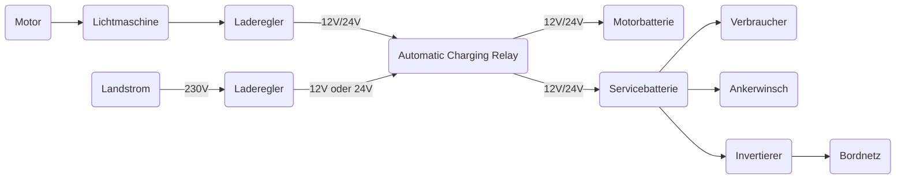

# Bordelektrik
Eine moderne Elektrik auf einer Segelyacht umfasst das gesamte Bordnetz, die Stromerzeugung, die Energiespeicherung und den Antrieb. Auf Sportbooten sind 12 bis 24V-Bordnetze üblich.

Das Bordnetz besteht aus zwei Netzen, einem 12V oder 24V Gleichstromnetz für die Verbraucher und einem Landstromnetz von 230V. Das Landstromnetz wird über einen Laderegler in Gleichstrom umgewandelt. Dabei wird über den ACR entschieden, welche Batterie geladen werden soll. Die Motorbatterie ist lediglich zum Starten des Motor benötigt. Die Verbraucherbatterie versorgt alle Verbraucher der Segelyacht: Navigation, Funk, Licht, Anker, ... . Beide Batterien können über den ACR und die Lichtmaschine geladen werden. Da die beiden Batteriebänke durch eine Schaltdiode getrennt sind, ist sichergestellt, dass auch nach einer kompletten Entladung der Verbraucherbatterien, etwa wegen eines vergessenen Lichtes, die Maschine noch gestartet werden kann. Da die Ankerwinsch über die Verbraucherbatterie betrieben wird, kann der Motor vom Geetriebe ausgekoppelt werden um die Verbaucherbatterie schneller geladen zu werden. Im absoluten Notfall können beide Batterie über die Kontaktdiode überbrückt werden.
Der Ladestatus der Batterien ist über die Panels an der Navigationsecke einsehbar. Dabei kann die Funktionalität der Servicebatterie leicht überprüft werden. Da 12V die Nennspannung für alle angeschlossenen System beträgt, wird der Landstrom gekappt und eines dieser Systeme (Autopilot, Plotter, Radar, … ) eingeschaltet. Falls die Batteriespannung unter 12 V fällt, sollte die Batterie dringend gewechselt werden. Weiterhin kann geprüft werden, ob bei eingeschalteter Lichtmaschine (Antriebsmaschine) die Batteriespannung bei 13.7V liegt. Weiterhin sollte die Lichtmaschine niemals laufen bei angeschlossenen Landstrom!