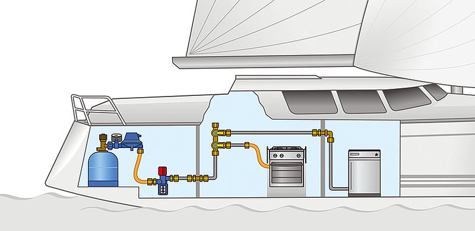

# Gassystem
Ein Gassystem auf einer Segelyacht dient dem Betrieb des Herds oder Ofens und muss strengen Sicherheitsnormen wie der DIN EN ISO 10239 sowie der DVGW-G608-Prüfung (Wiederholungsprüfung alle 2 Jahre) entsprechen.

## Wichtige Komponenten und Regeln

- Gaskasten (Flaschenkasten): Muss absolut gasdicht zum Innenraum sein, aufrecht stehende Flaschen aufnehmen und an der tiefsten Stelle eine Entwässerung/Entlüftung (mind. 19 mm Durchmesser) direkt nach außen oberhalb der Wasserlinie besitzen.
- Gasdruck: In Europa gilt ein einheitlicher Betriebsdruck von 30 mbar (ältere Anlagen oft 50 mbar; Mischinstallationen sind verboten).
- Leitungen: Fest verlegtes Kupferrohr oder rostfreier Stahl (VA). Kupferrohre müssen alle 50 cm, Edelstahlrohre alle 100 cm befestigt werden. Schläuche sind nur kurz am Gaskasten und am Endverbraucher erlaubt.
- Schläuche und Regler: Druckminderer und Gasschläuche haben eine maximale Lebensdauer von 6 Jahren und müssen dann getauscht werden.
- Absperrventile: Gut zugängliche Schnellschlussventile direkt am Verbraucher (z. B. in der Pantry) sind Pflicht. 
- Gasprüfung (G 608): Die Anlage muss alle zwei Jahre von einem zertifizierten Sachkundigen geprüft werden, um den Versicherungsschutz und die Betriebssicherheit zu gewährleisten.

## Nutzunghinweise für die Crew
- Den Haupthahn in der Pantry und der Hauptgashahn am Druckregler muss nach jeder Nuztzung geschlossen werden, da man sich nicht darauf verlassen kann, dass Thermo- und Regelventile durch den Vercharterer auf ihr fehlerlose Funktion geprüft werden. Weiterhin können bei Seegang Utensilien bei den Reglern verklemmt werden und somit Gas austreten. 
- Bei Gasbrand ist unbedingt zuerst der Hauptgashahn zu schließen!