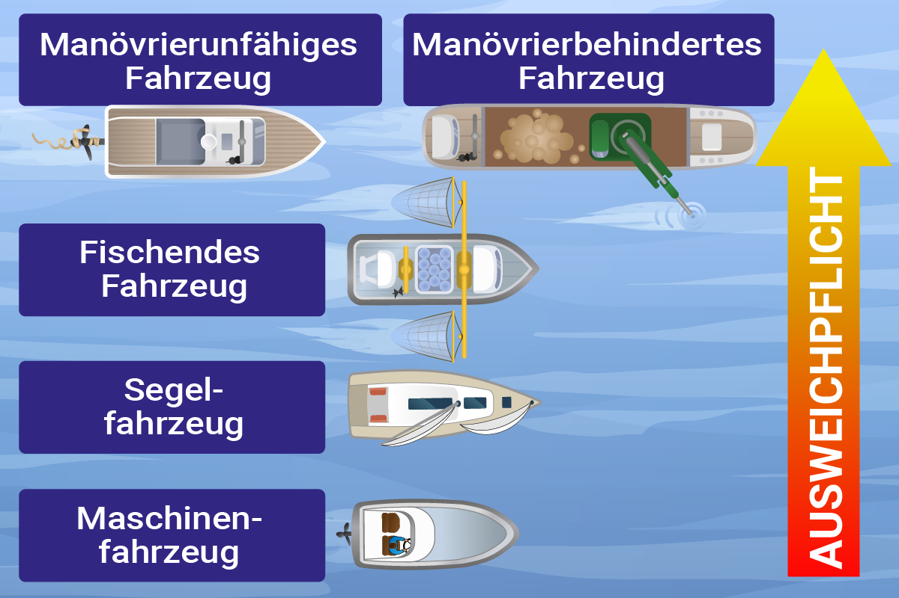

# Kollisionsverhütungsregeln (KVR)

Die KVR geben keine Vorfahrtrechte sondern teilt Verkehrsteilnehmer in Ausweichpflichtige und Kurshaltepflichtige ein. Die Regeln sind international gültig, sofern in den Hoheitsgebieten des Landes oder im Hafen nichts Anderes festgelegt wurde. Im Folgenden wird zwischen fahren innerhalb des Fahrwassers und außerhalb der Fahrwasser unterschieden:

## Im Fahrwasser
Regel 9: Enge Fahrwasser
- c) Ein Fahrzeug, das der Richtung eines engen Fahrwassers oder einer Fahrrinne folgt, muß sich so nahe am äußeren Rand des Fahrwassers oder der Fahrrinne an seiner Steuerbordseite halten, wie dies ohne Gefahr möglich ist.
- b) Ein Fahrzeug von weniger als 20 Meter Länge oder ein Segelfahrzeug darf nicht die Durchfahrt eines Fahrzeugs behindern, das nur innerhalb eines engen Fahrwassers oder einer Fahrrinne sicher fahren kann.
Sowas sieht man einem Sportschiff im Hafen nicht an! (Kieltiefe)
- c) Ein fischendes Fahrzeug darf nicht die Durchfahrt eines anderen Fahrzeugs behindern, das innerhalb eines engen Fahrwassers oder einer Fahrrinne fährt.
- d) Ein Fahrzeug darf ein enges Fahrwasser oder eine Fahrrinne nicht queren, wenn dadurch die Durchfahrt eines Fahrzeugs behindert wird, das nur innerhalb eines solchen Fahrwassers oder einer solchen Fahrrinne sicher fahren kann. 
(Das letztere Fahrzeug darf das in Regel 34 Buchstabe d vorgeschriebene Schallsignal geben, wenn es über die Absichten des querenden Fahrzeugs im Zweifel ist.)
- e) i) Kann in einem engen Fahrwasser oder in einer Fahrrinne nur dann sicher überholt werden, wenn das zu überholende Fahrzeug mitwirkt, so muß das überholende Fahrzeug seine Absicht durch das entsprechende Signal nach Regel 34 Buchstabe c Ziffer i anzeigen. Ist das zu überholende Fahrzeug einverstanden, so muß es das entsprechende Signal nach Regel 34 Buchstabe c Ziffer ii geben und Maßnahmen für ein sicheres Passieren treffen. Im Zweifelsfall darf es die in Regel 34 Buchstabe d vorgeschriebenen Signale geben.
- ii) Diese Regel befreit das überholende Fahrzeug nicht von seiner Verpflichtung nach Regel 13.
- f) Ein Fahrzeug, das sich einer Krümmung oder einem Abschnitt eines engen Fahrwassers oder einer Fahrrinne nähert, wo andere Fahrzeuge durch ein dazwischen liegendes Sichthindernis verdeckt sein können, muß mit besonderer Aufmerksamkeit und Vorsicht fahren und das entsprechende Signal nach Regel 34 Buchstabe e geben.
- g) Jedes Fahrzeug muß, wenn es die Umstände zulassen, das Ankern in einem engen Fahrwasser vermeiden.

## Außerhalb des Fahrwassers

Begegnen sich zwei Motorboote, gilt steuerbord vor backbord. 
Begegnen sich zwei Segelfahrzeuge gilt:
1. Wind von Steuerbord vor Wind von Backbord. 
2. Lee vor Luv (beide haben den Wind von der sleben Seite)
3. Hat man den Wind von Backbord und im Luv befindet sich ein Segelboot und es kann nicht basierend auf 1.) und 2.) entschieden werden, ist man ausweichpflichtig.

Bei Flaute ist die Position des Großbaums entscheidens, nicht die Segel. Prinzipiell muss der Ausweichpflichtige nach dem Heck des Kurshalteplfichtigen ausweichen.
