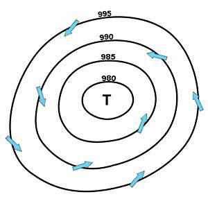
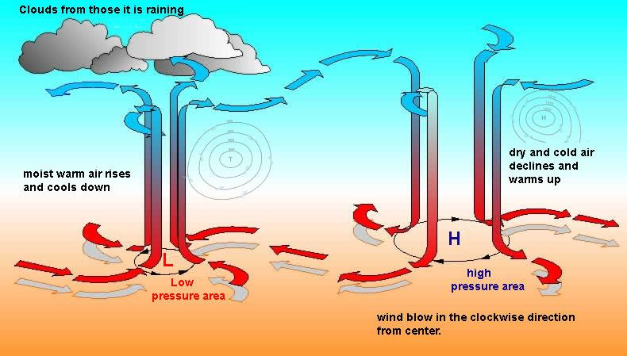
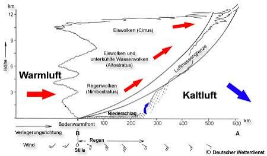
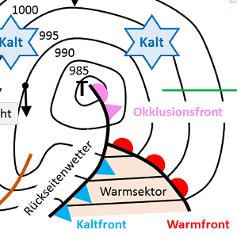
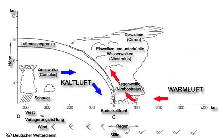

# Großwetterlage
Die Großwetterlage ist ein großräumiger Luftdruck- und Strömungszustand, der das Wetter in einer Region über mehrere Tage oder Wochen hinweg prägt. Dabei spielen die Verteilung und Bewegung von Hoch- und Tiefdruckgebieten die Hauptrolle.

## Tiefdruckgebiet
Tiefdruckgebiete (Zyklone) gehören zu den prägendsten Akteuren im Wettergeschehen. In der Meteorologie werden sie zunächst nach ihrer Entstehungsart in thermische und dynamische Tiefs eingeordnet. Beiden gemeinsam ist, dass sie verfügbare potenzielle Energie in kinetische Energie umsetzen: Warme Luft steigt auf, kalte Luft sinkt ab. Bei dynamischen Tiefs ist dieser Prozess deutlich ausgeprägter als bei thermischen. Darüber hinaus unterscheidet man zwischen stationären Zyklonen, die über längere Zeit an einem Ort verharren, und wandernden Zyklonen, die sich mit der Höhenströmung über weite Strecken verlagern. Besonders charakteristisch für dynamische Tiefs sind die begleitenden Wetterfronten: Kalt-, Warm- und Okklusionsfront markieren die Grenzen zwischen den beteiligten Luftmassen und bestimmen, wie sich das Wetter beim Durchzug verändert. Infolge der Corioliskraft rotieren großräumige Tiefdruckgebiete auf der Nordhalbkugel gegen den Uhrzeigersinn, auf der Südhalbkugel im Uhrzeigersinn.

Die folgenden Abschnitte beleuchten diese Aspekte näher: die Entstehung und Einteilung der Zyklone, ihr Zugverhalten sowie den Aufbau und die Wirkung der einzelnen Fronten.

### Thermische Tiefdruckgebiete (ortsfest / "stationär")
Thermische Tiefs, auch Hitzetiefs genannt, entstehen rein durch Temperaturunterschiede am Boden: Die Sonne heizt den Erdboden stark auf, und dieser gibt die Wärme an die darüberliegende Luft ab. Die erwärmte Luftsäule dehnt sich aus, wodurch sich die Flächen gleichen Drucks in der Höhe heben. Dort fließt Luft seitlich ab, die Luftsäule enthält weniger Masse, und der Luftdruck am Boden sinkt. In Bodennähe strömt von den Seiten kühlere Luft nach, die sich ihrerseits erwärmt und aufsteigt. Weil die Ursache im aufgeheizten Untergrund liegt, bleibt das Tief ortsfest, solange die Einstrahlung anhält. 

Thermische Tiefs sind meist flach, sie reichen also nur bis in die unteren Luftschichten. In der Höhe herrscht aufgrund der ausgedehnten, warmen Luftsäule oft sogar höherer Druck. Weil keine unterschiedlichen Luftmassen aufeinandertreffen, bilden sich keine Fronten. Die Corioliskraft wirkt wegen der geringen Ausdehnung und der oft niedrigen Breiten nur schwach, die Rotation ist daher wenig ausgeprägt.

Das Wetter hängt von der Feuchte ab: Über trockenen Gebieten bleibt der Himmel meist wolkenlos, bei ausreichend Feuchtigkeit kann die aufsteigende Luft Quellwolken und Wärmegewitter auslösen.

Kleinräumige Hitzetiefs lösen sich nachts oft auf, wenn der Boden auskühlt. Großräumige Hitzetiefs können dagegen über Wochen bis Monate bestehen, weil sie über Land mit starker Dauereinstrahlung immer wieder neu angetrieben werden.

**Beispiel: Iberisches Hitzetief**
Im Sommer heizt sich das Landesinnere der Iberischen Halbinsel stark auf, und es entsteht ein ausgedehntes Hitzetief. Es sorgt für heiße, trockene Witterung in Spanien und Portugal. Es kann außerdem warme Luft Richtung Mitteleuropa lenken und damit Hitzewellen begünstigen.

Weitere bekannte Beispiele sind das Hitzetief über Nordindien und Pakistan, das den südasiatischen Monsun mit antreibt, und das Saharatief.

### Dynamische Tiefdruckgebiete (wandernd / Frontenzyklonen)
Dynamische Tiefs entstehen in den mittleren Breiten an der Polarfront, wo kalte Polarluft und warme Subtropenluft aufeinandertreffen. Der große Temperaturgegensatz speist den Strahlstrom (Jetstream) in der Höhe. Mäandriert (schlängelt) dieser in großen Wellen, entstehen Bereiche, in denen die Höhenströmung auseinanderfließt (Divergenz). Fließt dort oben mehr Luft ab, als unten nachströmt, sinkt der Bodendruck, und es bildet sich ein Tief. Aufgrund der Corioliskraft rotiert es auf der Nordhalbkugel gegen den Uhrzeigersinn. Das Windfeld der Jungzyklone verformt die Polarfront: Auf der Ostseite des Tiefs strömt warme Luft aus Süden nach Norden, auf der Westseite kalte Luft aus Norden nach Süden und es bilden sich Warm- und Kaltfront heraus. Zwischen ihnen liegt der Warmsektor mit milder Luft. Im anschließenden Reifestadium ist das Tief am stärksten ausgeprägt, Druckgegensätze und Wind erreichen ihr Maximum. Danach beginnt die Okklusion: Die schnellere Kaltfront holt die Warmfront ein, und die Warmluft wird vom Boden abgehoben. Ohne weitere Warmluftzufuhr verliert das Tief seinen Antrieb, der Druck steigt wieder an, und das Tief füllt sich und löst sich schließlich auf. Die Energie für die gesamte Entwicklung stammt aus dem Temperaturgegensatz selbst: Das Tief wandelt verfügbare potenzielle Energie der Luftmassen in Bewegungsenergie um. Anders als thermische Tiefs reichen dynamische Tiefs bis in die obere Troposphäre. Sie werden von der Höhenströmung mitgeführt und ziehen meist von West nach Ost, oft in Serien (Zyklonenfamilien).

Hinweis: Warum werden "stationär" und "wandernd" oft mit "thermisch" und "dynamisch" vermischt?

Weil es Ausnahmen gibt. Ein dynamisches Tief wandert zwar meistens, kann aber im Okklusionsstadium quasi-stationär werden: Es löst sich vom Frontensystem, wird kaltkernig und von der Höhenströmung kaum noch weitergeführt, sodass es tagelang an Ort und Stelle verharren kann.

### Warmfront
An einer Warmfront gleitet wärmere Luft aus Südwest bis Süd flach auf die vorgelagerte kältere Luft auf. Die Aufgleitbewölkung kündigt sich schon viele Stunden vorher mit hohen Cirruswolken an, gefolgt von Cirrostratus und Altostratus, und schließlich zieht Nimbostratus mit gleichmäßigem, oft lang anhaltendem Niederschlag (Landregen) auf. Vor der Front fällt der Luftdruck, und der Wind dreht auf Süd bis Südost und frischt auf. Mit dem Durchzug der Front dreht der Wind nach rechts auf Südwest, die Temperatur steigt an und bleibt dann im Warmsektor annähernd konstant, der Luftdruck steigt nicht weiter an oder fällt kaum noch. Der Niederschlag lässt nach und die Bewölkung lockert auf.

### Der Warmsektor
Der Warmsektor ist der Bereich zwischen Warm- und Kaltfront. Er ist mit warmer, feuchter Subtropenluft gefüllt, die im Vergleich zur Luft vor der Warmfront deutlich milder ist. Der Wind weht gleichmäßig aus Südwest, ohne die Böigkeit der Kaltfront. Temperatur und Luftdruck bleiben annähernd konstant. Wegen der hohen Luftfeuchtigkeit ist die Sicht oft mäßig bis schlecht, und es bildet sich häufig tiefe Bewölkung (Stratus oder Stratocumulus), im Winter auch Hochnebel. Gelegentlich fällt leichter Niesel- oder Sprühregen, größere Niederschläge sind dagegen selten. Im Sommer kann die Bewölkung auch auflockern, sodass es sonnig, schwül und warm wird. Im Lebenszyklus des Tiefs wird der Warmsektor immer schmaler, weil die schnellere Kaltfront die Warmfront einholt (Okklusion).

### Kaltfront 
Die Kaltfront ist eine Luftmassengrenze, der im Allgemeinen eine Abkühlung folgt. Dabei schiebt sich die kältere Luft keilförmig unter die wärmere Luftmasse des Warmsektors und hebt diese steil an. Die aufsteigende, feuchtwarme Luft kühlt ab, die Luftschichten werden labil, und es bildet sich starke Quellbewölkung (Cumulonimbus). Schauer, Gewitter und teilweise heftige Böen deuten daher auf die Kaltfrontpassage hin, im Sommer häufiger mit Gewittern. Im Warmsektor weht der Wind aus Südwest, mit dem Durchzug der Front dreht er nach rechts auf West bis Nordwest und wird böig. Der Luftdruck steigt deutlich an, Temperatur und Taupunkt gehen zurück. Die Bewölkung lockert rasch auf, die Sicht ist in der Regel recht gut (Rückseitenwetter).

### Okklusionsfront
Die Okklusionsfront entsteht, wenn die schnellere Kaltfront die Warmfront einholt. Dabei wird die Warmluft vom Boden abgehoben und der Warmsektor am Boden verschwindet. Die Okklusion kennzeichnet das späte Stadium eines Tiefdruckgebietes und leitet dessen Auflösung ein.

Je nach Temperaturunterschied der beteiligten Kaltluftmassen unterscheidet man zwei Typen. Bei der Kaltokklusion ist die Luft hinter der Kaltfront kälter als die Luft vor der Warmfront. Sie schiebt sich unter beide Luftmassen, und die Temperatur sinkt beim Durchzug. Bei der Warmokklusion ist die Luft hinter der Kaltfront wärmer als die Luft vor der Warmfront. Die Kaltluft gleitet dann auf die kältere Luft vor der Front auf, und die Temperatur kann beim Durchzug gleich bleiben oder leicht steigen.

Das Wetter vereint Merkmale beider Fronten: Zunächst zieht Aufgleitbewölkung mit anhaltendem Niederschlag auf, danach können schauerartige Niederschläge folgen. Der Wind ist in der Regel im Vorfeld stark und böig, lässt aber mit fortschreitender Okklusion nach, weil sich die Druckgegensätze abbauen. Nach dem Durchzug folgt meist Rückseitenwetter, das oft noch von einzelnen Schauern geprägt ist, sodass sich das Wetter nicht sofort vollständig beruhigt.

## Hochdruckgebiet

### 

1. Thermische Hochdruckgebiete (Kälte-Hochs)

Diese entstehen rein durch extreme Abkühlung am Boden.
• Wie sie entstehen: Kalte Luft zieht sich zusammen, hat eine viel höhere Dichte und wird extrem schwer. Sie drückt mit großer Masse auf den Erdboden. Das ist die rein thermische Komponente.
• Wo du sie findest: Das berühmteste Beispiel ist das Sibirien-Hoch im Winter oder das Kanada-Hoch. Wenn im Winter wochenlang die Sonne fehlt, kühlt der Boden massiv aus. Die Luft sinkt ab und "liegt" schwer auf dem Kontinent.
• Eigenschaft: Sie sind relativ flach (reichen nicht sehr hoch in die Atmosphäre) und meist stationär. Sie bringen uns im Winter oft die eisige, aber sternenklare Luft aus dem Osten.

2. Dynamische Hochdruckgebiete (Wandernde & stationäre Höhen-Hochs)

Genau wie die dynamischen Tiefs werden diese Hochs vom Jetstream in der Höhe gesteuert – nur physikalisch genau spiegelverkehrt.
• Wie sie entstehen: Wenn der Jetstream in der Höhe Kurven schlägt (Mäander) oder abgebremst wird, stauen sich die Luftmassen in der oberen Atmosphäre (wie ein Stau auf der Autobahn). Da die Luft in der Höhe nicht nach oben entweichen kann, wird sie nach unten zum Erdboden gepresst. Beim Absinken erwärmt sich die Luft (Kompression), Wolken lösen sich auf. Am Boden steigt der Luftdruck massiv an.
• Wo du sie findest: Das Azorenhoch (Teil des subtropischen Hochdruckgürtels) ist das bekannteste dynamische Hoch für uns. Manchmal spaltet sich von diesem Gürtel ein Hoch ab und wandert als "Zwischenhoch" zwischen zwei dynamischen Tiefs über Mitteleuropa hinweg.
• Das "Omegahoch": Wenn so ein dynamisches Hoch sehr groß wird, kann es tagelang oder wochenlang wie ein massiver Block an Ort und Stelle verharren (stationär werden) und alle Tiefs um Mitteleuropa herumleiten. Das bringt uns dann die langen, stabilen Sommer-Hitzewellen.

## Wetterkarten

Wie kann ich ein Karte des DWD besser interpretieren? Die Bewölkung und den Druckverlauf, Hoch und Tiefs bekomme und die Fronten und wie der Wind weht... das bekomme ich hin,. Mir fællt es aber schwer aus der karte abzulesen, wie schnell die HOch und Tiefs sich bewegen und ihre Fronten......Neben Druckverlauf und Bewœlung sind noch ein haufen Zahlen mit denen ich nicht viel anfangen kann

Um die Zuggeschwindigkeit von Hochs, Tiefs und Fronten aus einer DWD-Bodenwetterkarte abzulesen, nutzt man am besten den Abstand der Isobaren sowie die Drucktendenzen (Zahlenwerte) auf der Karte. Da du die Grundlagen bereits beherrschst, konzentrieren wir uns direkt auf die Bewegung und die mysteriösen Zahlen.

1. Wie schnell bewegen sich Hochs, Tiefs und Fronten?

Auf einer statischen Wetterkarte gibt es zwei Hauptindikatoren für die Verlagerungsgeschwindigkeit:
• Der Isobaren-Abstand (Der "Antrieb"):
	• Liegen die Isobaren (Linien gleichen Luftdrucks) sehr eng beieinander, herrscht ein starker Druckgradient. Das bedeutet: Viel Wind und eine hohe Zuggeschwindigkeit des gesamten Systems samt seinen Fronten. Ein solches dynamisches Tief zieht oft mit 30 bis 50 Knoten (oder mehr) von West nach Ost.
	• Sind die Isobaren weit auseinander, bewegt sich das System nur sehr langsam oder wird stationär.
• Die Art der Front:
	• Kaltfronten bewegen sich im Schnitt deutlich schneller als Warmfronten (oft mit der 1,5- bis 2-fachen Geschwindigkeit). Wenn du siehst, dass eine Kaltfront dicht hinter einer Warmfront läuft, kannst du davon ausgehen, dass sie diese bald einholt (was dann zur Okklusion führt).

2. Was bedeuten die "vielen Zahlen"?

Die Zahlen, die über die Karte verstreut sind, lassen sich in drei Kategorien unterteilen:

A. Die Kern-Luftdruckwerte (Zentralwerte)

Direkt bei den Buchstaben H und T steht immer eine Zahl (z. B. 1025 oder 985). Das ist der gemessene Luftdruck im exakten Zentrum des Hochs oder Tiefs in Hektopascal (hPa).
• Für die Dynamik gilt: Sinkt dieser Wert bei einem Tief auf der Folgekarte (z. B. von 995 auf 985 hPa), vertieft sich das Tief. Es wird stärker, gefährlicher und zieht oft schneller. Steigt der Wert, füllt es sich auf und schwächt sich ab.

B. Die Isotachen / Verlagerungspfeile (Bewegungsmarker)

Auf professionellen DWD-Karten (insbesondere den Analysen und Vorhersagen für die Schifffahrt) findest du oft kleine Pfeile direkt an den Fronten oder Tiefkernen, die mit Zahlen versehen sind (z. B. ein Pfeil am Tiefkern mit der Zahl 25 oder NE 30).
• Die Bedeutung: Das ist die direkte Verlagerungsgeschwindigkeit und -richtung! NE 30 bedeutet beispielsweise: Das System bewegt sich nach Nordosten (North-East) mit einer Geschwindigkeit von 30 Knoten.

C. Der "Station Model"-Plot (Die Zahlen-Cluster)

An bestimmten Messstationen (oft als kleine Kreise dargestellt) siehst du ein standardisiertes Cluster aus Zahlen und Symbolen. Für dich als Segler sind dabei zwei Zahlenwerte für die Bewegung entscheidend:
1. Oben rechts (Der Luftdruck): Eine dreistellige Zahl (z. B. 125 oder 982). Das ist der auf Meereshöhe reduzierte Luftdruck gekürzt. 125 steht für 1012,5 hPa, 982 steht für 998,2 hPa (man ergänzt vorne eine 9 oder 10, je nachdem, was näher an 1000 liegt).
2. Unten rechts (Die Drucktendenz) – Extrem wichtig für dich!
Hier steht eine Zahl wie +15 oder -24 (manchmal mit einem kleinen Haken/Linienverlauf dahinter). Das ist die Druckänderung der letzten 3 Stunden (in Zehntel hPa).
	• -24 bedeutet: Der Luftdruck ist in den letzten 3 Stunden um 2,4 hPa gefallen.
	• Deine Ableitung für die Geschwindigkeit: Je höher dieser Wert (egal ob Plus oder Minus), desto schneller nähert sich ein Druckgebilde oder desto rasanter verändert es sich. Fällt der Druck schlagartig (mehr als 1 hPa pro Stunde), rauscht eine Kaltfront oder ein Tiefkern mit hoher Geschwindigkeit auf deine Position zu.

Profi-Tipp für den Cockpit-Alltag:

Um ein echtes Gefühl für das Tempo zu bekommen, reicht eine Karte nie aus. Vergleiche immer die Analyse-Karte (Ist-Zustand) mit der 24-Stunden-Vorhersagekarte. Nimm den Abstand zwischen der Front und deiner Position auf der ersten Karte und schaue, wo sie 24 Stunden später eingezeichnet ist. So siehst du sofort das "Nutztempo" des Systems für deinen Törn.
Möchtest du, dass wir uns ein konkretes Beispiel eines Station-Plots (Zahlenclusters) ansehen, damit du beim nächsten Blick auf die Karte sofort weißt, wo Temperatur, Wind und Drucktendenz stehen? Oder interessiert dich, wie du die Geschwindigkeit einer Kaltfront allein durch die Beobachtung der Wolken am Horizont schätzen kannst?

### Bewölkung

### Druckverlauf

Geschwindigkeit von Hoch und Tief ? von Karten ablesen??