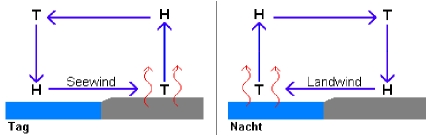

# Lokale Thermik
Die lokale Thermik beinhaltet Land- und Seewinde und lokale Wetterphänomene von Segelrevieren.

# Landwind und Seewind
Land- und Seewinde existieren aufgrund der unterschiedlichen Wärmekapazität von Land und Wasser. Da die Sonne das Land schneller aufheitzt als das Meer und das Land auch schnelle abkühlt als das Meer. Deshalb treten Landwinde und Seewinde besonders im Sonne auf oder in den Tropen. Tagsüber ist das Land wärmer als das Meer. Es entsteht über Land lokales Tiefdruckgebiet und auf der See ein lokales Hochdruckgebiet. Die Luft strömt auf bodennähe zum Land hin, also ein Seewind. Nachts bildet sich auf See ein lokales Tiefdruckgebiet und auf dem Land ein lokales Hochdruckgebiet, die Luft strœmt von Land zu See - Landwind. 

Die lokalen Winde finden zyklonal statt
- ca. 10:00 – 11:00 Uhr | Das Erwachen (Seewind beginnt): Die Sonne steht seit einigen Stunden am Himmel. Das Land hat sich nun so weit aufgeheizt, dass es wärmer als das Wasser ist. Der Seewind setzt sanft ein.
- ca. 14:00 – 16:00 Uhr | Der Höhepunkt des Seewinds: Das Land hat seine Höchsttemperatur erreicht. Die Temperaturdifferenz zum kühlen Meer ist jetzt am größten. Der Seewind weht oft frisch bis stark und bringt kühlere Meeresluft an den Strand.
- ca. 18:00 – 20:00 Uhr | Die abendliche Windstille ("Kimm"): Die Sonne sinkt, das Land kühlt ab. Sobald Land und Meer exakt die gleiche Temperatur haben, schläft der Wind komplett ein. Die Wasseroberfläche wird oft spiegelglatt.
- ca. 22:00 – 23:00 Uhr | Die Umkehr (Landwind beginnt): Das Land ist nun kälter als das Wasser. Die Thermik dreht sich um: Die Luft strömt jetzt vom Land hinaus aufs Meer.
- ca. 06:00 – 08:00 Uhr | Der Höhepunkt des Landwinds: Kurz nach Sonnenaufgang ist das Land nach der langen Nacht maximal ausgekühlt. Der Landwind erreicht kurz vor seinem Ende seine größte Stärke.
- ca. 09:00 Uhr | Die morgendliche Windstille: Die Morgensonne heizt das Land wieder auf. Die Temperaturen gleichen sich erneut kurz an, der Wind schläft ein, bevor der Zyklus von vorn beginnt.

In beiden Fällen findet im lokalen Tiefdruckgebiet eine Wolkenbildung statt. Es bilden sich lokale Cumuluswolken und steigen auf. Beim Aufstieg werden die Wolken Richtung Hochdruckgebiet abegtrieben und die Luft kühlt ab und die Wolken lößen sich auf.

# Adria
Die lokalen Starkwinde Bora und Jugo auf der Adria.

## Bora

Die Bora (kroatisch Bura, slowenisch Burja) ist ein extrem starker, kalter und trockener Fallwind, der vor allem an der Ostküste der Adria (Kroatien, Slowenien, Montenegro und im Golf von Triest) auftritt.

### Entstehung und Eigenschaften

- Das Prinzip: Schwere, eiskalte Luft staut sich im Winter im Hinterland hinter den Küstengebirgen (wie dem Dinarischen Gebirge). Wenn der Druckunterschied zu dem wärmeren Meer unten groß genug ist, stürzt die Kaltluft über die Bergkämme hinab in Richtung Küste.
- Die Wucht: Weil die kalte Luft sehr schwer ist und durch die Schwerkraft beschleunigt wird, bricht die Bora oft völlig überraschend los. Sie weht in heftigen, unberechenbaren Orkanböen.
- Spitzengeschwindigkeiten: Einzelne Böen können Geschwindigkeiten von über 250 km/h erreichen. Damit gehört sie zu den stärksten Fallwinden der Welt.
- Nahe der Küste kann die Bora keine Wellen bilden, deswegen passt das Wellen bild nicht zu der Windstärke.
  
### Arten der Bora

- Schwarze Bora (zyklonale Bora): Entsteht bei einem dominante Tiefdruckgebiet über Oberitalien. Sie wird oft von dunklen Wolken, Regen oder Schnee begleitet. Die schwarze Boa trifft vorallem im Winter auf. Gleichzeitig befindet sich ein Hochdruckgebiet mit kalter Luft in in Nordwesteuropa.Beide Gebiete "saugen" kalte Polarluft aus Osteuropa an. Diese Luft sammelt sich beim dinarischen Gebirge. Die Druckdifferenz zwischen dem starken Tiefdruckgebiet auf dem Mittelmeer und der kalten Luft auf dem Balkan erreicht eine kritischen Punkt und kalte Fallwinde sind die Folge. Diese kalten Fallwinde treiben sich unter die heiße Luft auf dem Mittelmeer und es entsteht Stockwerkwolken.
- Weiße Bora (antizyklonale Bora): Wird durch ein kräftiges Hochdruckgebiet im osteuropäischen Binnenland ausgelöst und weht bei strahlend blauem Himmel und Sonnenschein, ist aber dennoch eiskalt. Die weiße Boa tritt vorallem im Sommer auf. Dieses Hochdruckgebiet bringt kalte Polarluft in den Südwesten an das dinarische Gebierge. Die kalte Luft sammelt sich dort und der Druckunterschied zwischen Land und See erreicht einen kritischen Punkt. Ein Tiefdruckgebiet auf dem Mittelmeer ist nicht zwingend notwendig.
 
## Jugo

Der Jugo (kroatisch für „Südwind“, im italienischen Sprachraum auch als Scirocco oder Široko bekannt) ist das exakte meteorologische Gegenteil zur kalten, böigen Bora. Er ist ein warmer, feuchter und sehr stetiger Wind aus südöstlicher bis südlicher Richtung, der die gesamte Adria beherrscht. Der Jugo baut sich im Gegensatz zur Bora meist langsam über Tage hinweg auf, hält dann aber oft tagelang an. 

## Entstehung des Jugo
Das Phänomen entsteht durch das Zusammenspiel zweier großer Drucksysteme:
   1. Ein starkes Tiefdruckgebiet über dem westlichen Mittelmeer oder Nordafrika (z. B. ein Genuatief).
   2. Ein Hochdruckgebiet über dem östlichen Mittelmeer oder der Balkanhalbinsel.

Dieses System saugt heiße, extrem trockene Kontinentalluft direkt aus der Sahara an. Auf ihrem Weg nach Norden zieht diese Luftmasse über das warme Mittelmeer und die Adria. Dabei nimmt sie enorme Mengen an Feuchtigkeit auf. Wenn sie schließlich auf die kroatische Inselwelt und die Steilküsten trifft, ist sie warm, schwül und mit Wolken beladen.

## Arten des Jugo
Ähnlich wie bei der Bora unterscheidet man auch hier zwei Varianten: 

* Zyklonaler (Tiefdruckgebiet) Jugo (Die "schmutzige" Variante): Dies ist die häufigste Form, besonders im Herbst und Winter. Sie bringt dichte, dunkle Wolken, anhaltenden Starkregen und oft Gewitter. Ein faszinierendes Merkmal: Da der Wind Wüstensand aus Afrika mitbringt, wäscht der Regen diesen aus – zurück bleibt eine feine, gelb-braune Sandschicht auf Booten, Autos und Häusern. 
* 
* Antizyklonaler (Hochdruckgebiet )Jugo (Der "trockene" Jugo): Tritt eher im Frühjahr auf. Hierbei bleibt der Himmel oft klar oder nur leicht diesig, es regnet nicht, aber der Wind ist dennoch sehr warm, spürbar feucht und nimmt im Tagesverlauf mit der Sonneneinstrahlung an Fahrt auf.

Wichtig: Da der Jugo sich über die gesamte Adria aufbaut und Wassermassen in die Adira geschiben werden. Haben die Wellen eine Dünung. Sprich die Welle eilt dem Wind vorraus! Das Wellenbild passt nicht zum Wind.